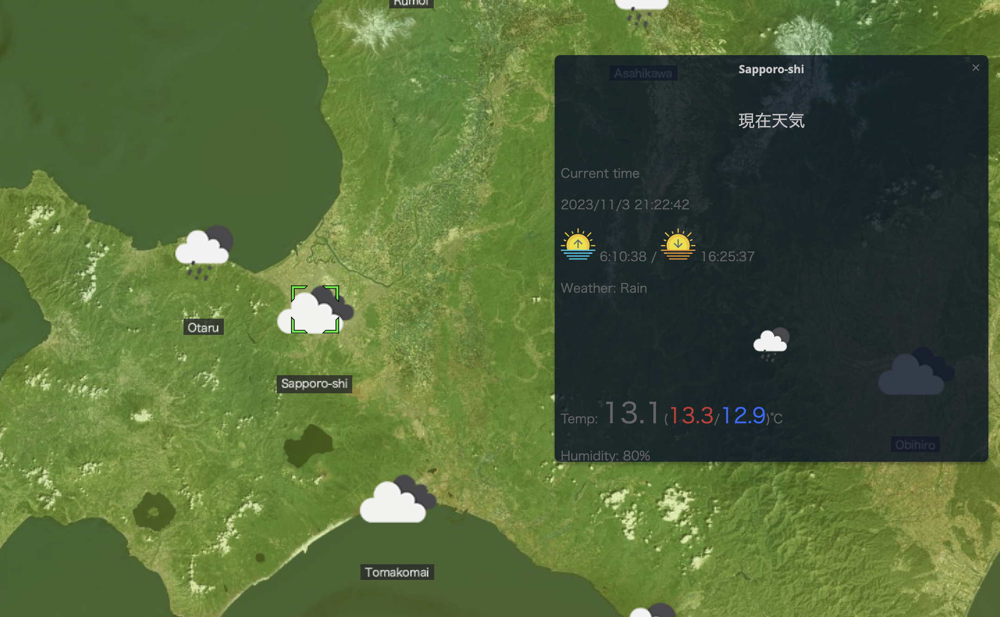
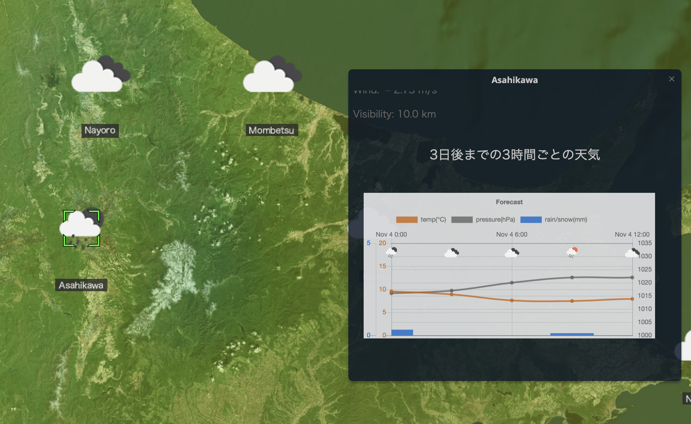
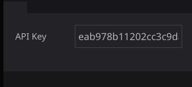
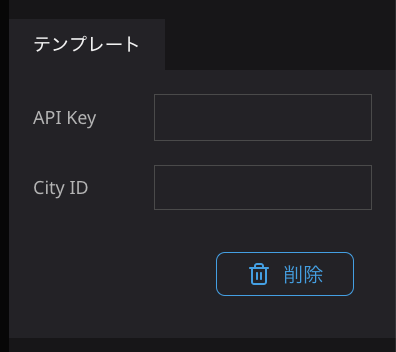

# Open Weather plugin
このプラグインでは、インフォボックス内に、OpenWeatherMapより取得した現在時刻の気象情報と3時間ごとの将来天気を表示させるブロックを追加することができます。

現在時刻の気象情報は「Current Weather Data」より
- 日の出時刻、日の入り時刻
- 天気
- 気温
- 湿度
- 気圧
- 風向風速
- 視程

を表示します。

天気予報は「5 Day / 3 Hour Forecast」より
3時間ごとの気温、気圧、降水/降雪量をグラフ表示します。

## 使い方
- プラグインをインストールしたら、インフォボックスのブロックから「Current Weather Block」、「Forecast Weather Block」、「Weather Icon Block」を追加します。
- 「Current Weather Block」は現在時刻の気象情報をインフォボックスに表示します。
- 「Forecast Weather Block」は3時間毎の気温、気圧、降水量の予測をインフォボックスに表示します。
- 「Weather Icon Block」はマップのアイコンを天気に合わせたアイコンに変更します。
- それぞれのBlockの機能を有効にするにはOpenWeatherMapのAPI Keyの設定が必要です。
  

- API keyはOpenWeatherMapにサインインし、各自のキーを取得してください。
- Current weatherブロックのAPI key入力欄に取得した自身のAPI keyを入力します。
- City IDに取得したい地点のIDを入力すると、その場所の情報を表示します。

- City IDは[こちら](http://bulk.openweathermap.org/sample/)からお調べください。